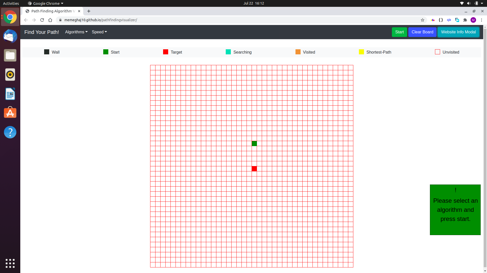
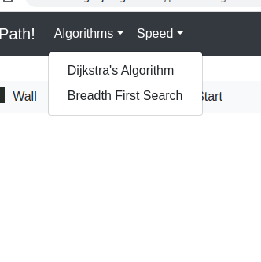
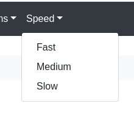
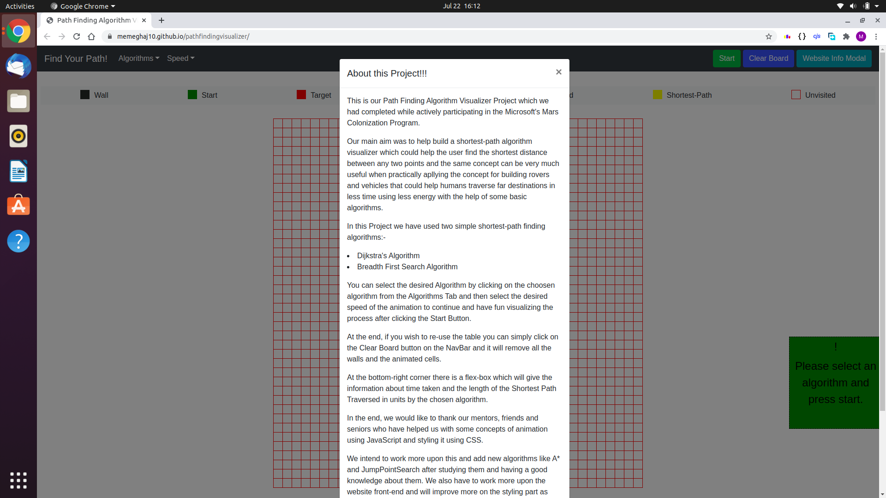
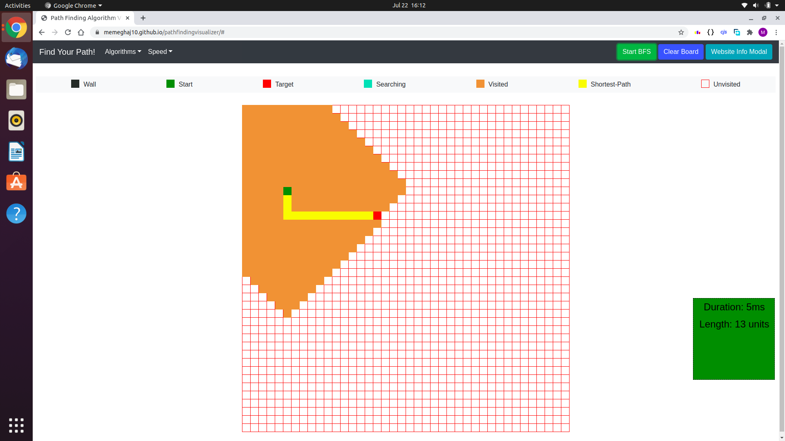

# Path Finding Algorithm Visualizer 

This is a simple web-based application for developing our own path-finding algorithm visualizer.

We have used simple technologies like:-

1. `HTML`.

2. `CSS`.

3. `JavaScript`.

Our web-app can serve the following functionalities:-

1. Select `Algorithm` of choice, mainly `Breadth-First-Search` and `Dijkstra's Algorithm`.

2. Select `speed of animation`

3. For more info about the project, the user can visit the `InfoModal` tab.

Afte the algorithm and the speed of the animation is selected we can then put walls (black-coloured squares) by our choice and specifiy the blockages in the traversed path.

After that the user can click the `Start` button and the visualization of the algorithm starts.

After the whole process has been completed, for a re-use you can click on the `clear-board` button.

We intend to improve it further and bring in more algorithms like `A*` and `JumpFirstSearch` .

